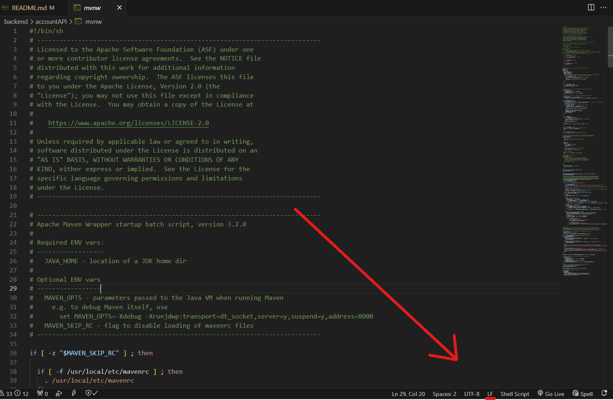

# Web Application Boilerplate Code


# RMIT COSC2299 SEPT Major Project

# Group Information

## Group-P5-01

## Members
* Keely Smith (s3898340)
* Myat Theingi Nwe (Gigi) (s3963447)
* Tanya Tran (s3843142)
* Huy Do (s3894502)
* Antoni Giannakopoulos (Toni) (s3895923)
* Kevin Chen (s3780646)

## Records

* Github repository: https://github.com/cosc2299-sept-2023/team-project-group-p05-01
* Github Project Board : https://github.com/orgs/cosc2299-sept-2023/projects/16
* MSTeams : https://teams.microsoft.com/l/team/19%3aNChlnKbsNFo61Gx2VLHjMo5etMlfKM6DgI-l8FfGS341%40thread.tacv2/conversations?groupId=f663c8bd-84db-444a-bc08-1aaf3f67e12b&tenantId=d1323671-cdbe-4417-b4d4-bdb24b51316b 

	
## Code documentation - Release 1.0.0
* Product Search and Categorization
* Price Comparison
* Delivery Organization
* Notifications and Alerts
* User-Friendly Interface


# Initial Setup

## Setup your environment 
You will need to have in your system

- Java 17.0 or higher
- Node and npm
- Apache Maven
- IDE or Editor
- Docker 
    - found here (https://www.docker.com/)

Other tools will be required to complete the project (e.g., Docker)

Branch naming conventions: feature or bug / documentation or backend or frontend or database / task number _ short description
for more information read the [CONTRIBUTING.md](CONTRIBUTING.md)

## How to run the application? (recommended)
- Ensure you have docker open, and navigate to the repository root.
- run the command:
```
docker-compose up -d --build
```
- Ensure the containers are running with 
```
docker ps
```
- Access the content by travelling to:
```
http://localhost:3000/
```
- to stop the containers run the command:
```
docker-compose down
```

> **_NOTE:_** if you have an error about mvmw you will need to convert ./mvnw end of line sequence to LF
to do so open the ./mvnw file in VSCode and in the bottom right change CRLF to LF



## Backend (Not recommended)
- cd into backend/(seperateAPI)
- Confirm you can run your applicaiton (./mvnw package && java -jar target/[accountAPI]-0.0.1-SNAPSHOT.jar)
- Confirm you can run your applicaiton (./mvnw package && java -jar target/[productAPI]-0.0.1-SNAPSHOT.jar)

## Frontend (Not recommended)
- cd into frontend/
- Install dependencies "npm install"
- Run the app with "npm start"

